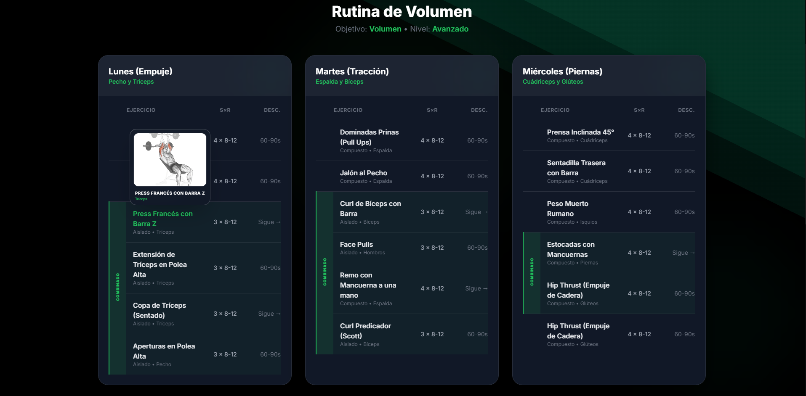
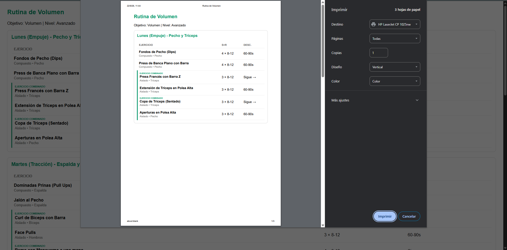
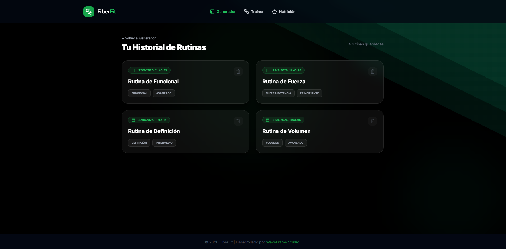
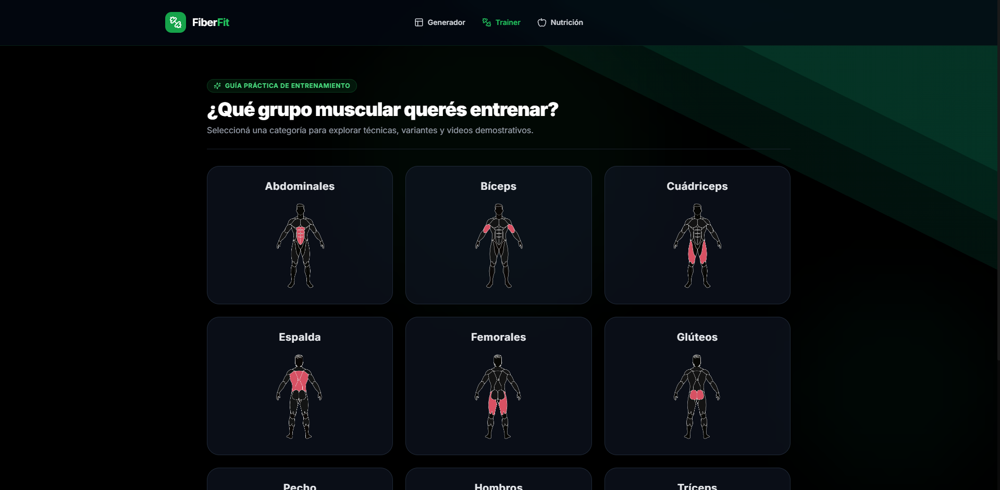
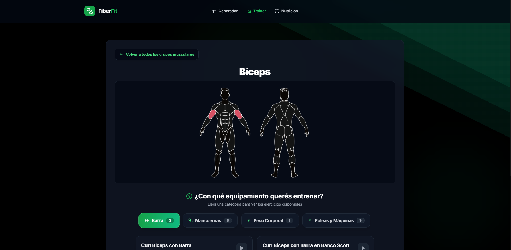
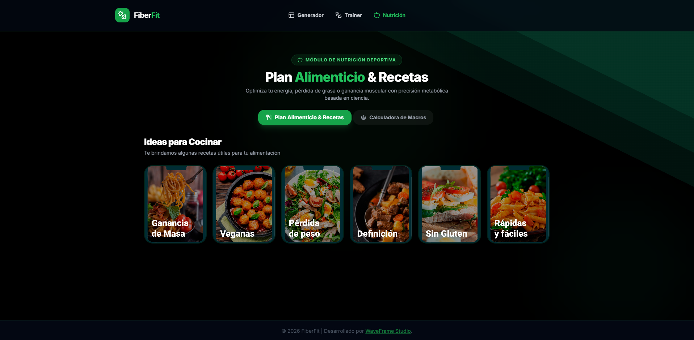

  
  
  <h1 style="font-size: 3rem; margin-top: 10px;">💪 FiberFit</h1>
  
  

    <strong>Plataforma Integral de Entrenamiento Inteligente, Algoritmos Adaptativos & Guía Nutricional.</strong>
  

  
  

    
    
    
    
    
    
  

   

---

## 🚀 Sobre el Proyecto

**FiberFit** es una plataforma web integral de entrenamiento y nutrición diseñada para maximizar tus resultados físicos con respaldo científico y tecnología moderna. Mediante la configuración de variables clave (objetivo, frecuencia semanal, nivel de experiencia, equipamiento disponible y tiempo por sesión), el sistema genera rutinas de entrenamiento hiper-personalizadas y estructuradas día a día.

Además, **FiberFit** incorpora un **Módulo de Nutrición** con calculadora de macronutrientes y catálogo de recetas fit, la **Sección Trainer** con diagramas anatómicos interactivos por grupo muscular, gestión de historial persistente respaldada por **Supabase** y exportación de rutinas a PDF. Todo bajo un diseño estético *premium* en *Dark Mode* potenciado con animaciones de **GSAP**.

---

## ✨ Características Principales

- **🧠 Algoritmo de Generación Inteligente**: Crea rutinas dinámicas analizando tu nivel, equipamiento disponible y objetivos personales (Hipertrofia, Fuerza, Pérdida de Peso).
- **🥗 Módulo de Nutrición & Recetas**: Calcula requerimientos calóricos diarios y propone planes nutricionales con recetas categorizadas (Definición, Ganancia de Masa, Veganas, Sin Gluten, Rápida).
- **🏋️ Sección Trainer & Diagrama Anatómico**: Explora guías ilustradas de ejercicios clasificadas visualmente por grupos musculares e interactúa con un modelo anatómico intuitivo.
- **💾 Historial Persistente con Supabase**: Almacena tu historial de rutinas generadas de forma segura y accesible desde cualquier dispositivo.
- **📄 Exportación a PDF**: Imprime o descarga tu rutina semanal en formato PDF optimizado, listo para entrenar sin distracciones en el gimnasio.
- **🏃‍♂️ Interfaz Premium & GSAP**: Experiencia de usuario inmersiva con animaciones en tiempo real y diseño responsive en modo oscuro.

---

## 📷 Vistas Previas del Proyecto

<table>
  <tr>
    <td align="center" width="50%">
      
       
      <em>Configuración de Parámetros de Entrenamiento</em>
    </td>
    <td align="center" width="50%">
      
       
      <em>Rutina Generada — Vista Semanal</em>
    </td>
  </tr>
  <tr>
    <td align="center" width="50%">
      
       
      <em>Módulo de Nutrición — Calculadora & Recetas Fit</em>
    </td>
    <td align="center" width="50%">
      
       
      <em>Sección Trainer — Guía Ilustrada de Ejercicios</em>
    </td>
  </tr>
  <tr>
    <td align="center" width="50%">
      
       
      <em>Diagrama Anatómico Interactivo por Grupo Muscular</em>
    </td>
    <td align="center" width="50%">
      
       
      <em>Historial — Gestión de Rutinas Guardadas</em>
    </td>
  </tr>
  <tr>
    <td align="center" width="50%">
      
       
      <em>Planes Nutricionales — Categorías & Recetas</em>
    </td>
    <td align="center" width="50%">
      
       
      <em>Exportación PDF — Formato Formateado para Gimnasio</em>
    </td>
  </tr>
</table>

---

## 🛠️ Stack Tecnológico

- **Core:** React 18 & TypeScript
- **Build Tool:** Vite
- **Estilos & UI:** Tailwind CSS (Dark Theme Premium)
- **Animaciones:** GSAP (GreenSock)
- **Íconos:** Lucide React
- **Base de Datos & BaaS:** Supabase
- **Exportación:** jsPDF, html2canvas

---

## 🔗 Contacto & Soporte

Diseñado, desarrollado y mantenido con excelencia por **[WaveFrame Studio](https://waveframe.com.ar/)**.

> ✨ Si esta plataforma impulsó tus entrenamientos y desarrollos, no olvides dejar una ⭐ a este repositorio. ¡A romper esas marcas!
