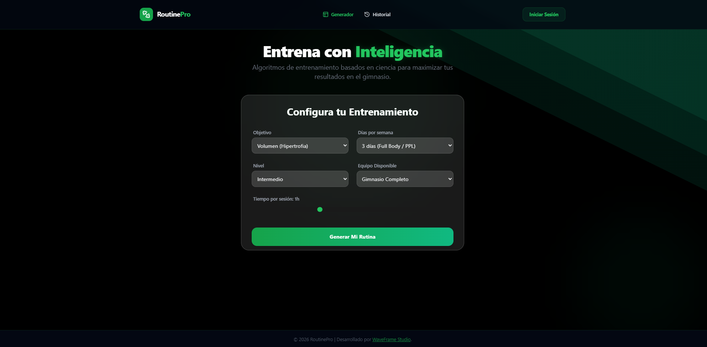
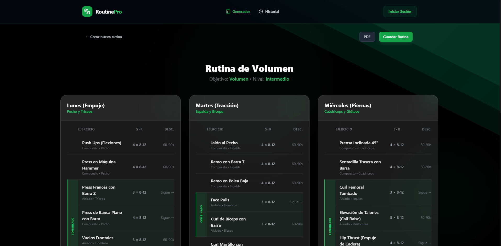
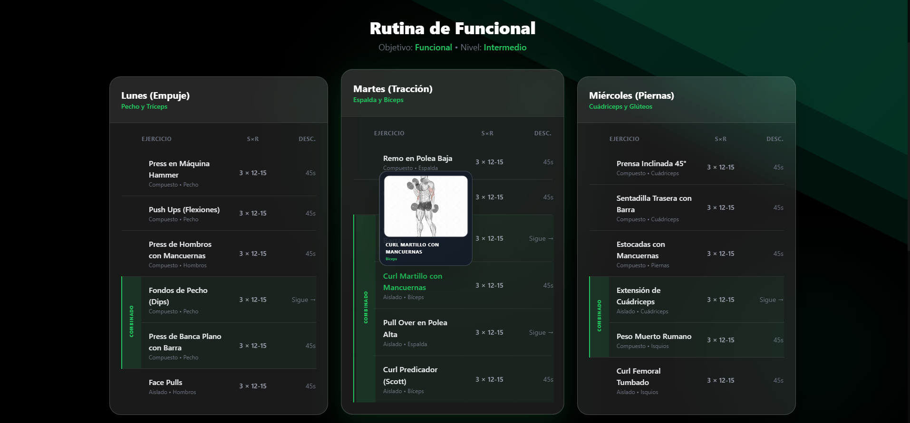
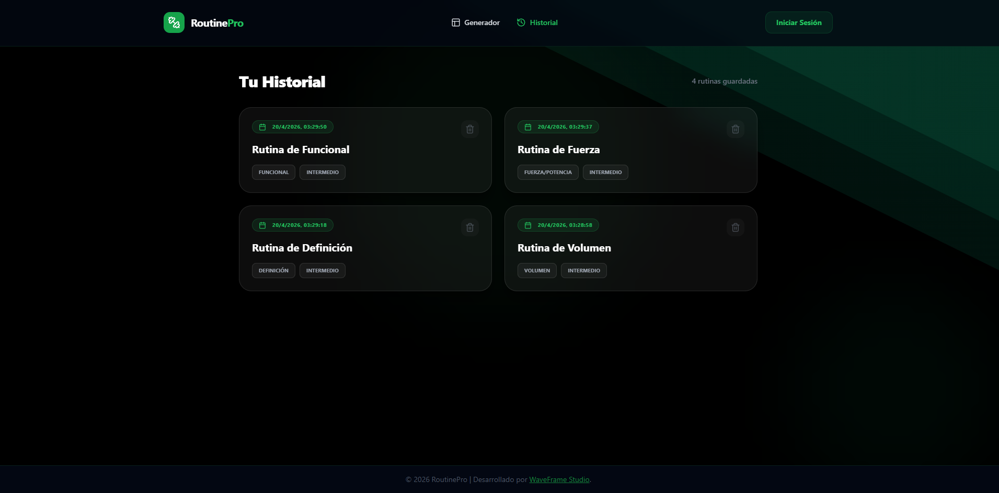

  
  
  <h1 style="font-size: 3rem; margin-top: 10px;">💪 RoutinePro</h1>
  
  

    <strong>El Generador de Rutinas de Entrenamiento Definitivo, Basado en Ciencia y Algoritmos Inteligentes.</strong>
  

  
  

    
    
    
    
    
    
    
  

   

---

## 🚀 Sobre el Proyecto

**RoutinePro** es una aplicación moderna de generación de rutinas de ejercicio diseñada para maximizar tus resultados en el gimnasio. Mediante la configuración de variables clave (objetivo, frecuencia semanal, nivel de experiencia, equipamiento disponible y tiempo por sesión), el sistema genera rutinas de entrenamiento personalizadas, estructuradas e inteligentes.

Diseñado con un enfoque estético *premium*, **RoutinePro** incorpora interfaces fluidas guiadas por **GSAP**, vistas oscuras *(Dark Mode)* con acentos en tonos esmeralda, un panel de gestión eficiente y flujos de usuario extremadamente intuitivos. Además, toda tu progresión y el historial de rutinas quedan resguardados de forma escalable gracias al uso de **Supabase**.

---

## ✨ Características Principales

- **🧠 Algoritmo de Generación Inteligente**: Crea rutinas de manera dinámica analizando tu nivel, el equipamiento del que dispones y tus objetivos personales.
- **💾 Sistema de Guardado de Historial**: Almacena tus rutinas generadas de forma persistente y segura en bases de datos ágiles y modernas (Supabase).
- **📄 Exportación a PDF**: Imprime o descarga tu rutina de la semana en formato PDF, lista para llevarla al gimnasio y lograr una desconexión digital durante tu sesión.
- **🏃‍♂️ Animaciones Fluidas**: Efectos de interfaz envolventes, creados y potenciados en tiempo real por GSAP.
- **📱 Responsividad Total**: Experiencia de usuario adaptada a la perfección para brindarte la misma fluidez tanto en dispositivos móviles como en navegadores de escritorio.

---

## 📷 Vistas Previas del Proyecto

<table>
  <tr>
    <td align="center" width="50%">
      
       
      <em>Pantalla Principal — Configuración de Parámetros</em>
    </td>
    <td align="center" width="50%">
      
       
      <em>Rutina Generada — Vista Día por Día</em>
    </td>
  </tr>
  <tr>
    <td align="center" width="50%">
      
       
      <em>Historial — Rutinas Guardadas</em>
    </td>
    <td align="center" width="50%">
      
       
      <em>Panel — Estadísticas y Progreso</em>
    </td>
  </tr>
</table>

---

## 🛠️ Stack Tecnológico

El proyecto está diseñado bajo una arquitectura modular y escalable usando **TypeScript** en todo su ciclo de desarrollo:

### 🎨 Frontend (Client)
- **Core:** React 18
- **Build Tool:** Vite
- **Estándar Visual:** Tailwind CSS
- **Interacciones:** GSAP (GreenSock)
- **Íconos:** Lucide-React
- **Utilidades:** jspdf, html2canvas (para generación de PDF)

### ⚙️ Backend (Server)
- **Runtime:** Node.js
- **Framework:** Express.js
- **Base de Datos & BaaS:** Supabase
- **Seguridad:** CORS, Dotenv

---

## 🔗 Contacto & Soporte

Diseñado, desarrollado y mantenido con excelencia por **[WaveFrame Studio](https://waveframe.com.ar/)**.

> ✨ Si esta plataforma impulsó tus entrenamientos y desarrollos, no olvides dejar una ⭐ a este repositorio. ¡A romper esas marcas!
